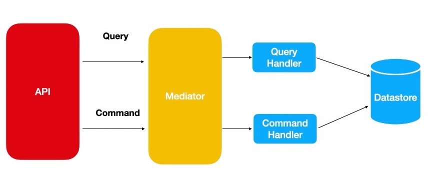
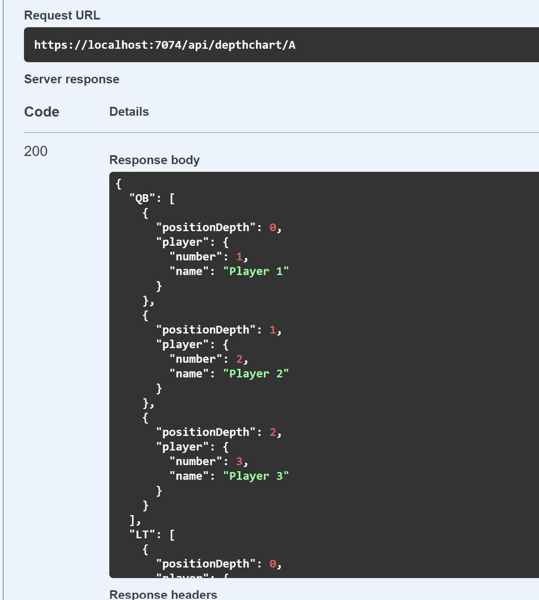

# Full Depth Chart

## Project Description

This project is a .NET 7 application that manages a depth chart for sports teams. It leverages several modern technologies and design patterns to ensure maintainability, scalability, and performance. The application follows the CQRS pattern, utilizing Entity Framework with an in-memory database for simplicity.

## Technology Stack

- .NET 7
- C#
- Entity Framework Core
- In-Memory Database (SqlLite)
- MediatR
- FluentValidation
- AutoMapper
- Global Exception Handling & Logging
- Docker

## Architecture

### Layers

1. **API Layer**
    - Contains the minimal api routes.
    - Contains all the service registrations and global exception handler.
2. **Application Layer**
    - Contains the MediatR handlers, Data Transfer Objects (DTOs), FluentValidation validators, and AutoMapper profiles.
3. **Domain Layer**
    - Contains the domain models and the business logic for managing the depth chart.
4. **Persistence Layer**
    - Contains the database context and team repository implementations.

### Pattern

The project follows the Command Query Responsibility Segregation (CQRS) pattern, using the same database for both command and query operations. In a real-world scenario, the query operations would be connected to a read replica with proper indexing to enhance read performance.



## Instructions to Run

### Using Docker

1. Ensure you have Docker installed and running on your machine. You can start the application using Docker Compose with the following command:

   ```bash
   docker-compose up -d

   # Note: For local code build use:

   docker compose -f .\docker-compose.debug.yml up
   ```
2. Browse [http://localhost:5000/swagger/index.html](http://localhost:5000/swagger/index.html) on your browser.
### Using Visual Studio
1. Open the solution in Visual Studio.
2. Build the solution to restore the necessary packages and compile the project.
3. Set the startup project to the API project.
4. Run the application.
5. You can also use dotnet run from Api.

    ```
    cd .\src\Api\

    dotnet run
    ```

## Continuous Integration

A GitHub workflow has been set up to build and test the project automatically. The workflow file is located in the .github/workflows directory.

## Repository Summary

### API Routes

The API layer exposes several routes for managing the depth chart. Below is an example of the available routes:

- `POST /api/team` - Create a team for the sport.
- `POST /api/depthchartentry` - Add a new entry player to the depth chart.
- `GET /api/depthchart/{teamId}` - Get the full depth chart for a team.
- `GET /api/teams/{sport}` - Get teams for the sport.
- `GET /api/depthchart/{teamId}/backups?position={positionId}&playerNumber={playerNumber}` - Get the backups for a player for respective postion.
- `DELETE /api/depthchartentry/{teamId}?position={postionId}&playerNumber={playerNumber}` - Remove a player from the depth chart.

### Application Layer

- **MediatR Handlers**: Handle the commands and queries.
- **DTOs**: Define the data structures used for communication between layers.
- **FluentValidation**: Provides validation rules for the DTOs.
- **AutoMapper Profiles**: Maps domain models to DTOs and vice versa.

### Domain Layer

- **Models**: Define the core business entities.
- **Business Logic**: Contains the logic for managing the depth chart.

### Persistence Layer

- **DbContext**: Manages the database connection and entity configurations.
- **Repository**: Provides data access methods for the domain models.

## Data

### Supported Teams
- NFL
- MLB
- NHL
- NBA
- TEST - *Note: This is for integration tests.*

### Sample Data
I have already seeded some data for Team A in NFL.

E.g.: Full Depth chart for Team A


## Assumptions
1. I have not added the Player as separate entity. It is being simply stored as part of depth entry.
2. After removing the player from the depth chart for a position, I am decrementing the position depth of the backups.
3. No two players for a position will have same position depth in the team.
4. No security or authorisation is required.
